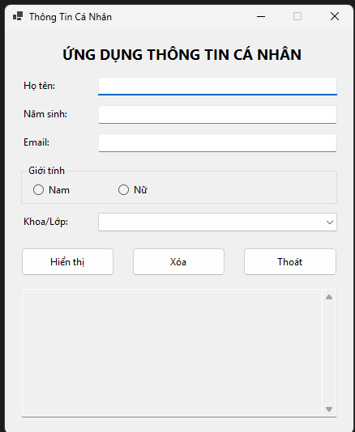
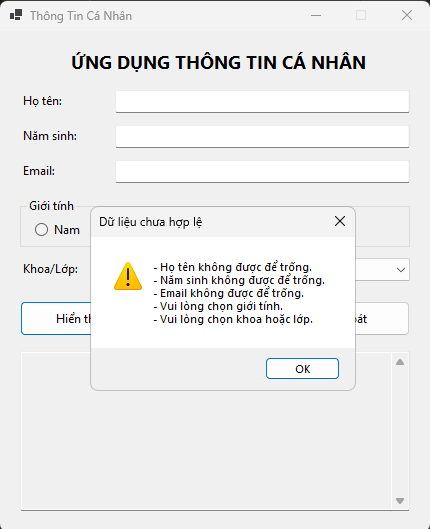
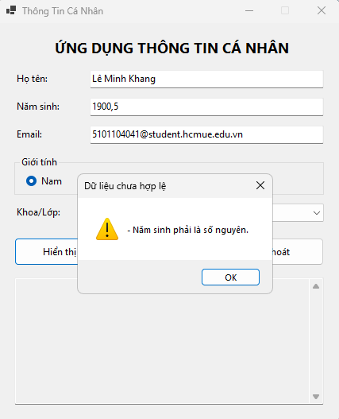
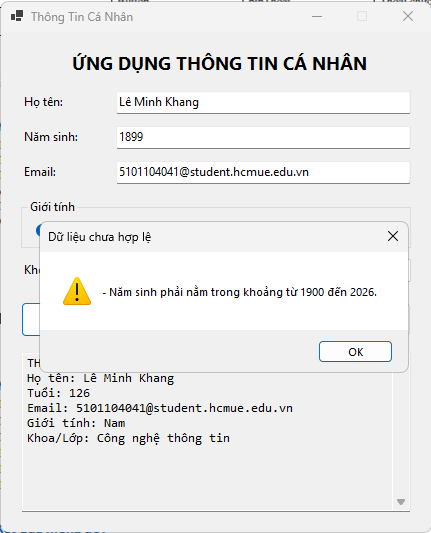

# Bài Lab 01 - Ứng Dụng Thông Tin Cá Nhân

**Học phần:** COMP1019 - Lập trình trên Windows
**Công cụ:** Visual Studio, Windows Forms App (.NET 8), C#

## Mô tả
Ứng dụng Windows Forms cho phép nhập thông tin cá nhân sinh viên (họ tên, năm sinh,
email, giới tính, khoa/lớp), kiểm tra dữ liệu hợp lệ, và hiển thị kết quả tổng hợp
khi nhấn nút **Hiển thị**. Nút **Xóa** đưa form về trạng thái rỗng, nút **Thoát**
hỏi xác nhận trước khi đóng chương trình.

## Cấu trúc project
- `Program.cs` — điểm khởi chạy ứng dụng
- `Form1.Designer.cs` — khai báo và bố trí control
- `Form1.cs` — xử lý sự kiện, kiểm tra dữ liệu, hiển thị kết quả

## Cách chạy
1. Mở `QuanLyThongTinCaNhan.csproj` bằng Visual Studio (2022+, có cài .NET desktop
   development workload).
2. Nhấn F5 để build và chạy.

## Kết quả

### 1. Giao diện khi mới mở chương trình
Form hiển thị đầy đủ các control theo yêu cầu: tiêu đề, 3 ô nhập (Họ tên, Năm sinh,
Email), GroupBox chọn giới tính, ComboBox khoa/lớp, 3 nút lệnh và khung hiển thị kết quả.

### 2. Kiểm tra khi bỏ trống toàn bộ dữ liệu
Nhấn **Hiển thị** khi chưa nhập gì — chương trình gom toàn bộ lỗi thiếu dữ liệu vào
một MessageBox duy nhất (họ tên, năm sinh, email trống; chưa chọn giới tính; chưa
chọn khoa/lớp).

### 3. Kiểm tra năm sinh không phải số nguyên
Nhập năm sinh dạng thập phân (`1900,5`) — chương trình phát hiện và báo lỗi
"Năm sinh phải là số nguyên."

### 4. Kiểm tra năm sinh ngoài khoảng cho phép
Nhập năm sinh `1899` (nhỏ hơn 1900) — chương trình báo lỗi "Năm sinh phải nằm trong
khoảng từ 1900 đến 2026." Khung kết quả phía dưới vẫn giữ kết quả hợp lệ lần hiển thị
trước đó (Họ tên: Lê Minh Khang, Năm sinh 1900 → Tuổi 126) vì lần nhập này bị chặn lại,
không cập nhật kết quả mới.

