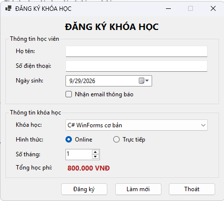
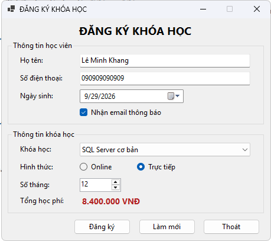
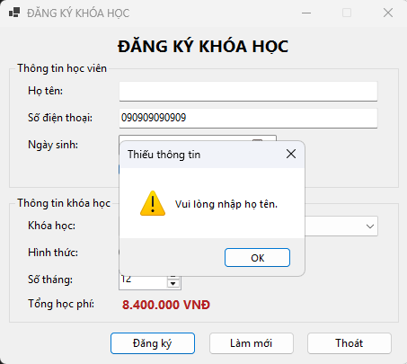
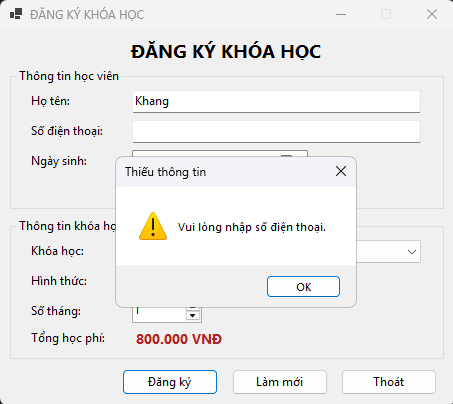
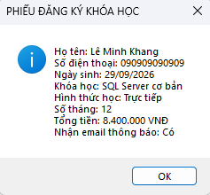
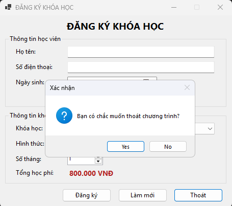

# CourseRegistrationApp

Bài Lab 5 - COMP1019 Lập trình trên Windows: ứng dụng WinForms đăng ký khóa học.

## Chức năng
- Nạp danh sách khóa học khi Form Load, mặc định chọn khóa đầu tiên và hình thức Online.
- Tự tính lại tổng học phí khi đổi khóa học hoặc số tháng (1-12).
- Nút Đăng ký: kiểm tra họ tên, số điện thoại, khóa học rồi hiển thị phiếu đăng ký bằng MessageBox.
- Nút Làm mới: đưa toàn bộ dữ liệu về mặc định, con trỏ về ô họ tên.
- Nút Thoát: hỏi xác nhận Yes/No trước khi đóng.

## Bảng học phí
| Khóa học | Học phí/tháng |
|---|---|
| C# WinForms cơ bản | 800.000 VNĐ |
| SQL Server cơ bản | 700.000 VNĐ |
| Web Frontend cơ bản | 750.000 VNĐ |
| Lập trình Python cơ bản | 650.000 VNĐ |

## Chạy chương trình
Yêu cầu .NET 8 SDK và Windows.

```
dotnet run
```

## Hình ảnh
Chụp và chèn ảnh vào thư mục `images/`:

1. Giao diện khi mới mở
   
2. Đổi khóa học / số tháng, tổng tiền thay đổi
   
3. Báo lỗi khi bỏ trống họ tên
   
   
4. Phiếu đăng ký
   
5. Hộp thoại xác nhận thoát
   
